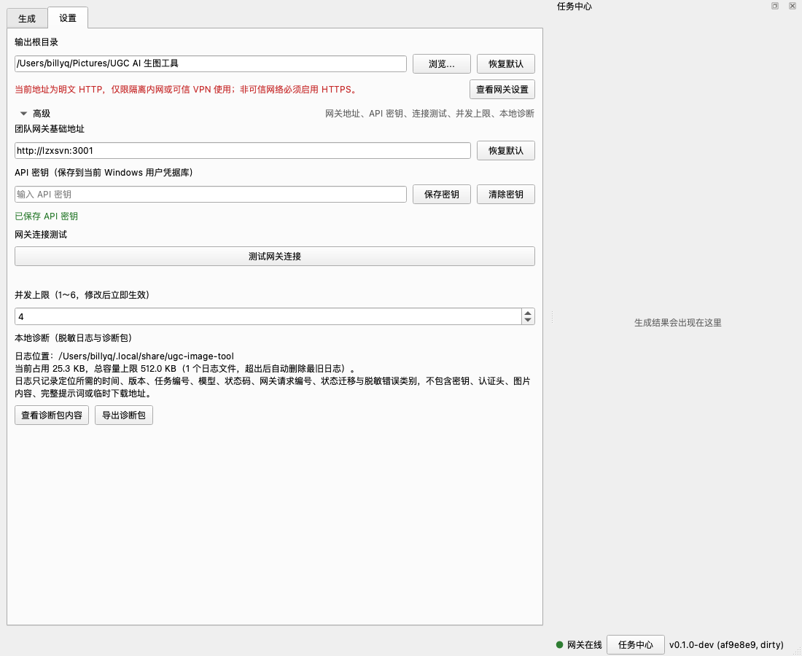
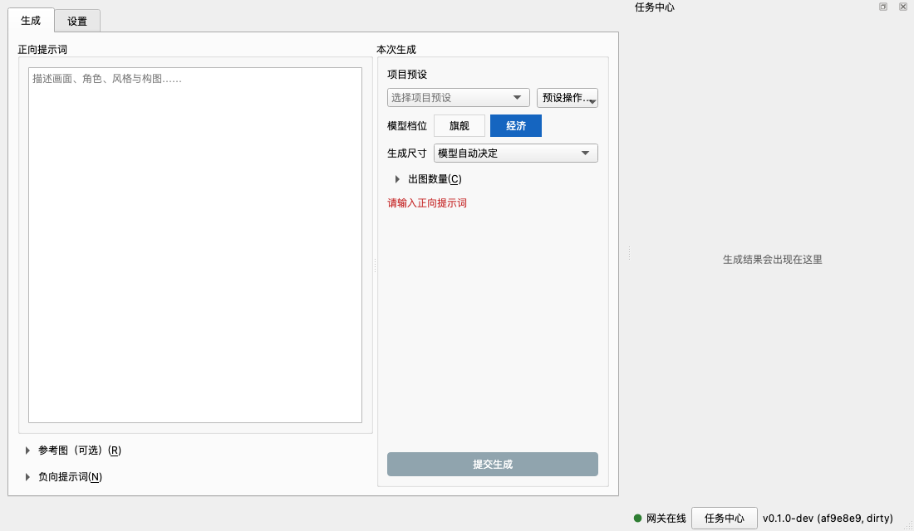

# UGC AI 生图工具

面向蛋仔派对与千星 UGC 美术团队的本地图片生成工作台。提示词和参考图都在本地填写、管理，任务通过团队网关提交生成，生成结果保存在本机；多个任务可并行提交，不会互相阻塞。

## 下载与安装

从发布页下载对应平台的压缩包，解压即用，无需安装依赖：

- **Windows**：`ugc-image-tool-x.x.x-win-x64.zip`
- **macOS**（Apple Silicon）：`ugc-image-tool-x.x.x-macos-arm64.zip`

本软件未做代码签名，首次启动会被系统拦截，放行一次即可：

- **Windows**：SmartScreen 提示"未知发布者"时，点 **更多信息 → 仍要运行**。
- **macOS**：必须用**访达双击解压**（命令行 `unzip` 会破坏应用包），然后**右键应用图标 → 打开**。

## 首次配置

首次启动后，先切换到**设置**页完成三项配置，即可开始生成。

**1 → 输出根目录。** 生成结果的保存位置，默认为系统图片目录下的 `UGC AI 生图工具` 文件夹。点 **浏览…** 可更换，**恢复默认** 可随时还原。

**2 → 团队网关与 API 密钥（在"高级"内）。** 网关基础地址已预置为团队默认地址 `http://lzxsvn:3001`，一般无需修改。API 密钥向团队负责人获取，粘贴后点 **保存密钥**；密钥只保存在本机系统凭据库（Windows 凭据库 / macOS 钥匙串），不会写入任何配置文件。

**3 → 测试网关连接。** 点 **测试网关连接**，各项显示通过即配置完成。底部状态栏圆点变绿、显示"网关在线"后，就可以回到生成页提交任务了。

> ⚠️ **网络安全提示**：默认网关使用明文 HTTP，API 密钥、提示词和参考图在传输中不加密。仅限隔离内网或可信 VPN 使用，**请勿在公共网络使用**。若网关已启用 HTTPS，把地址改为 `https://` 开头即可，设置页的红色警告会消失。

可选项：**并发上限**（1～6）控制同时执行的生成任务数量，达到上限后新任务自动排队，修改后立即生效。

## 基础界面

**生成页（左半区）**

- **正向提示词**：描述画面、角色、风格与构图。这是唯一必填项，留空时无法提交。
- **本次生成**：
  - **项目预设**：针对蛋仔派对 / 千星整理的提示词起点，选中后自动填入正向与负向提示词，可在此基础上修改。内置预设只读，可通过"预设操作"复制为个人预设后编辑。
  - **模型档位**：**旗舰**（质量优先）与**经济**（成本优先）两档，档内具体模型由团队随版本更新，无需关心。
  - **生成尺寸**：默认"模型自动决定"，也可从预设尺寸中选择；部分模型支持自定义宽高。
  - **出图数量**：一次任务期望返回的图片张数，多张结果可分别保存。
- **参考图（可选）**：图片编辑任务的输入图片，最多 3 张，按顺序提供给模型，每张的用途在提示词中说明。提交时会保存快照，之后改动原文件不影响已提交的任务。
- **负向提示词**：填写不希望出现的内容，需要模型支持才生效。

**任务中心（右侧停靠面板）**

- 显示当前任务队列与每张生成结果：排队中的任务按提交顺序执行，多个任务并行推进。
- 面板可拖动换边、浮动或关闭；关闭后有新任务完成时，状态栏的 **任务中心** 按钮会高亮提醒，点它即可召回。
- 生成结果随任务记录（模型、提示词、尺寸、时间、任务编号）一起保存在输出根目录，便于追溯。

**状态栏（底部）**

- 右侧圆点实时显示网关状态：绿色"网关在线"、黄色"使用缓存模型"（网关暂时不可达，模型列表可能过期）、红色"网关离线"（无法提交，顶部会同时弹出提示横幅，可一键跳转到设置检查连接）。
- 最右侧是版本号，点一下即可复制，反馈问题时请附上。

## 遇到问题

在 **设置 → 高级 → 本地诊断** 中，点 **查看诊断包内容** 可先确认内容，再点 **导出诊断包** 发给开发人员。诊断包只包含时间、版本、任务编号、模型、状态码等定位所需信息，不含 API 密钥、提示词全文和图片内容。
