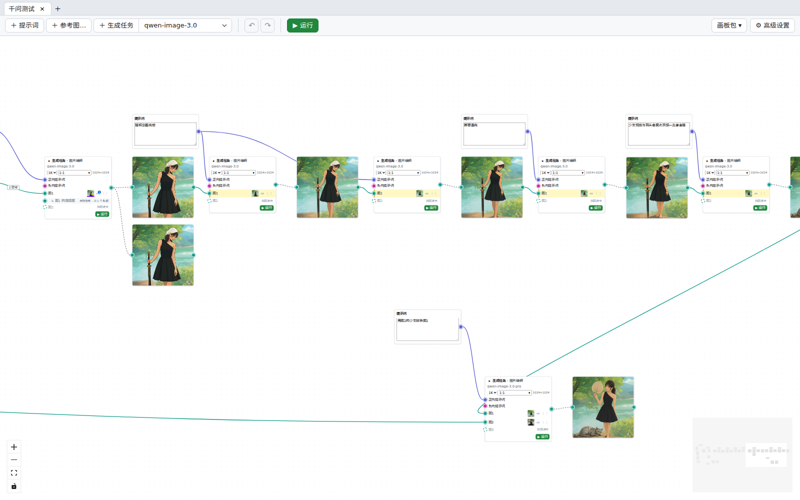

  

# Kacha（咔嚓）

📸 咔嚓一下，图就来了。

面向蛋仔派对与千星 UGC 美术团队的本地图片生成工作台。以节点图画板为主界面：提示词、参考图、生成任务、结果都是画板上的节点，连线表达「这次输入从哪儿来」。生成只经团队网关提交，结果保存在本机。

## 下载与安装

到 [Gitea Releases](http://lzxsvn:3000/qinyuanj/kacha/releases) 下载对应平台的附件。自动更新已在开发分支实现，首次迁移目标仍待首个带 updater 签名的正式版发布；已有旧版附件按该版本发布说明使用。

首个带 updater 签名的正式版将使用以下分发格式：

| 附件 | 适用平台 |
| --- | --- |
| `kacha-<版本>-win-x64-setup.exe` | Windows 10 21H2+ / Windows 11（x64），NSIS 按当前用户安装，依赖 WebView2 |
| `kacha-<版本>-macos-arm64.zip` | macOS，仅 Apple Silicon，首次手动替换 `Kacha.app` 到 `/Applications` |

Updater 签名独立于操作系统代码签名。Windows 没有购买代码签名证书，首次安装或运行可能需要在 SmartScreen 点「更多信息 → 仍要运行」；macOS 仅 ad-hoc 签名、未经 Apple 公证，首次需要 Gatekeeper 放行。macOS 真机安装、迁移与自动更新**未验收**，不在本次验收范围内。

旧 Windows 免安装版需要手动安装一次；迁移沿用同一用户的数据、系统凭据和输出根目录。首次使用在「高级设置」填团队网关地址与 API 密钥。现有 HTTP Gitea 与网关仅用于可信内网或 VPN，不提供传输加密。

安装迁移、更新状态及故障恢复见 [自动更新用户指南](docs/release/auto-update-user-guide.md)；已验证事实与待补证据见 [Windows 自动更新验收记录](docs/release/auto-update-windows-acceptance.md)。

## 主要功能

- **画板**：多画板标签页、框选 / 平移、撤销 / 重做、右键菜单、拖线建节点。
- **文生图与图片编辑**：生成任务节点按模型能力露出端口，参考图按 `图N` 接入；超出模型输入上限时自动缩放。
- **区域指示**：在参考图上框选矩形，按 `区域N` 分色并在提示词里指代。
- **迭代动作**：以此继续编辑、加为参考图、生成变体，每一步都留下连线，谱系可追溯。
- **图层拆分**：支持的模型可把结果拆为带透明通道的图层。
- **画板包**：把画板连同引用的图片打成单个文件，换机器导入后继续工作。
- **诊断包**：一键导出脱敏日志与设置，不含 API 密钥。
- **自动更新（开发分支，待正式发布）**：自动检查并后台下载更高版本的正式版，展示进度与更新说明；由用户点击「重启并更新」，任务队列为空且全部已打开画板与界面状态保存成功后才安装。

内置模型：Seedream 5.0 pro / lite、qwen-image-3.0-pro / qwen-image-3.0。

## 反馈

需求与缺陷请到 [GitHub Issues](https://github.com/TLOBillyQ/kacha/issues) 提交。
